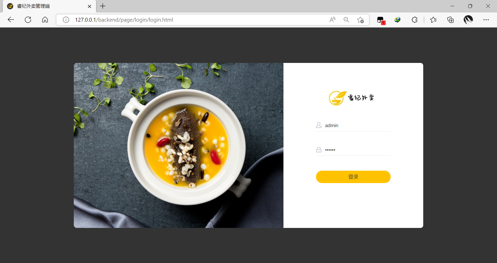

# 睿纪外卖-Reggie
Spring+Vue 前后端分离的Web练手项目

***
## 简介
JavaWeb练手项目，系统分为PC端的管理系统和移动端的点餐系统。

管理系统管理员工，菜品和套餐信息，并可以查看移动端用户的下单信息。

点餐系统用户可以查看管理端上传的菜品与套餐信息，可以将菜品添加入购物车，并进行下单。
同时还能查看自己的历史订单信息，一键再下单。

***
## 技术栈
### 前端 
- *Vue*
- *ajax*
- *element-ui*
### 后端
- *SpringBoot*
- Spring
- SpringMvc
- *Mybatis / MybatisPlus*

***
## 运行

- 再Idea中导入项目，下载maven依赖
- 执行项目中的SQL脚本创建数据库
- 在yml配置文件中修改自己的数据库用户名与密码
- 提供自己的邮箱号与smtp密码，用于手机端验证码获取
- 构建项目并运行

***
## 延伸阅读
项目主要听网课跟着做的，并在老师基础上完成了一部分拓展功能，项目本身其实还有其他很多问题。

*[黑马程序员瑞吉外卖项目](https://www.bilibili.com/video/BV13a411q753)*

*[点击这里访问我的博客](http://www.echoes.work)*
